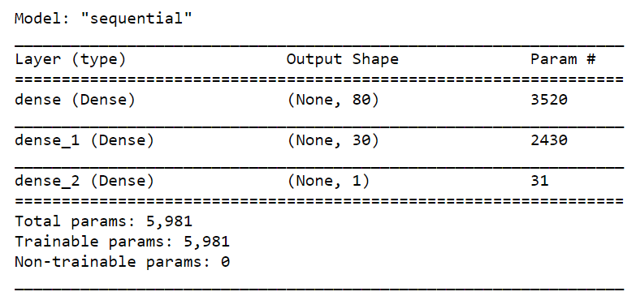
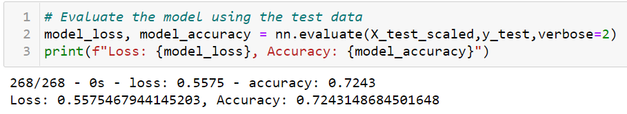
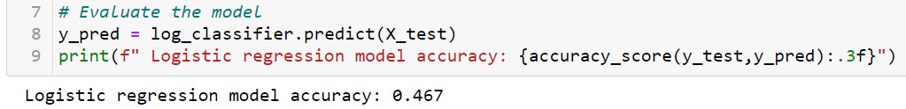
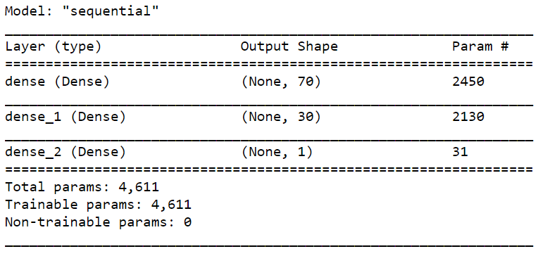
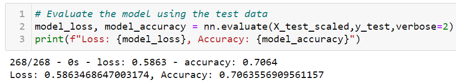
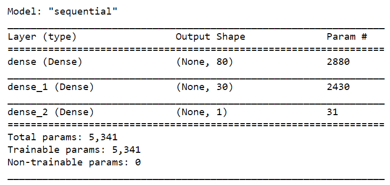
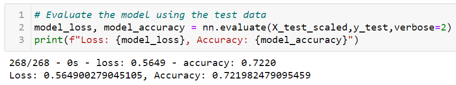
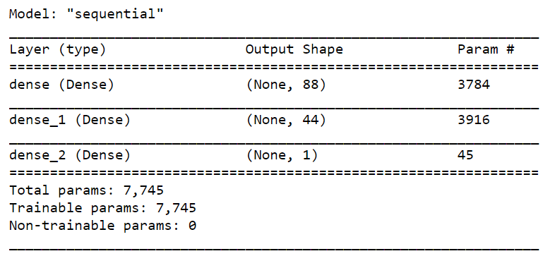
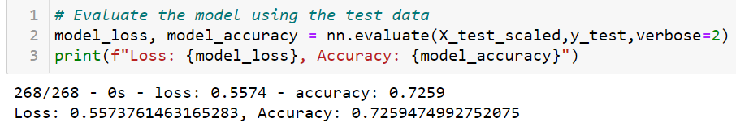

# Neural Network Charity Analysis
## Overview
In this project, we explored neural networks and deep machine learning using TensorFlow in Python. We tried to create a binary classifier that could predict whether applicants would be successful if funded by Alphabet Soup.
## Resources
-	Data Source: charity_data.csv
-	Software: Python 3.7.9, Anaconda 4.9.2
## Data
### Data Description
Our dataset contained more than 34,000 organizations that had received funding from Alphabet Soup over the years. Within this dataset were a number of columns that captured metadata about each organization, such as the following:
-	EIN and NAME—Identification columns
-	APPLICATION_TYPE—Alphabet Soup application type
-	AFFILIATION—Affiliated sector of industry
-	CLASSIFICATION—Government organization classification
-	USE_CASE—Use case for funding
-	ORGANIZATION—Organization type
-	STATUS—Active status
-	INCOME_AMT—Income classification
-	SPECIAL_CONSIDERATIONS—Special consideration for application
-	ASK_AMT—Funding amount requested
-	IS_SUCCESSFUL—Was the money used effectively
### Data Processing
-	EIN and NAME columns were removed as they provided no valuable information for the analysis.
-	Encoded categorical variables.
-	Split the preprocessed data into features and target arrays.
-	Split the preprocessed data into training and testing datasets.
-	Standardized numerical variables using Scikit-Learn’s StandardScaler class, then scaled the data.
-	Created a neural network model.
-	Saved and exported the results to an HDF5 file.
## Results
### Result of Initial Attempt 
The description of our model was as follows:

	

-	The model achieved an accuracy rate of 72.43%. 
Our target performance for the accuracy rate was 75%. Therefore, we attempted to optimize the accuracy rate.
### Attempts to optimization
Firstly, we tried to compare our neural network with logistic regression:

-	The logistic regression model accuracy was 46.70%, which was much lower than our neural network's accuracy rate. 

Secondly, we made many attempts to change our categorical variables and the number of inputs for two layers:
The result for the second attempt:

	

The result for the third attempt:

	

The result for the  fourth attempt:

	

-	As the results showed above, none of our attempts were able to increase the accuracy rate above 75%.
## Summary
To summarize, our model could help to predict whether applicants would be successful if funded by Alphabet Soup with an accuracy rate of around 72%. However, we failed to increase the accuracy rate to 75%.
 
Trail and error were crucial in the machine learning. Many methods, such as adjusting the input data, adding more neurons to a hidden layer, or adding more hidden layers could help us to optimize the model.